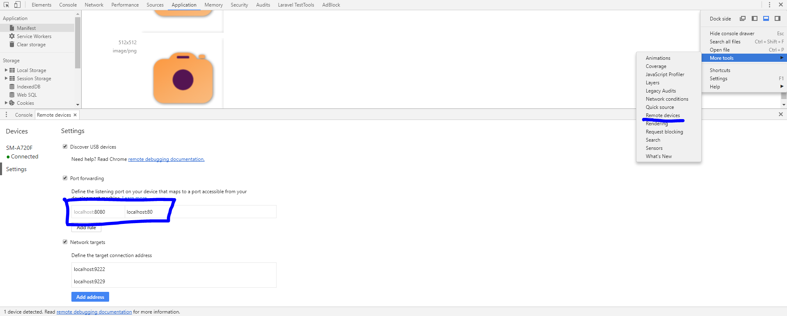
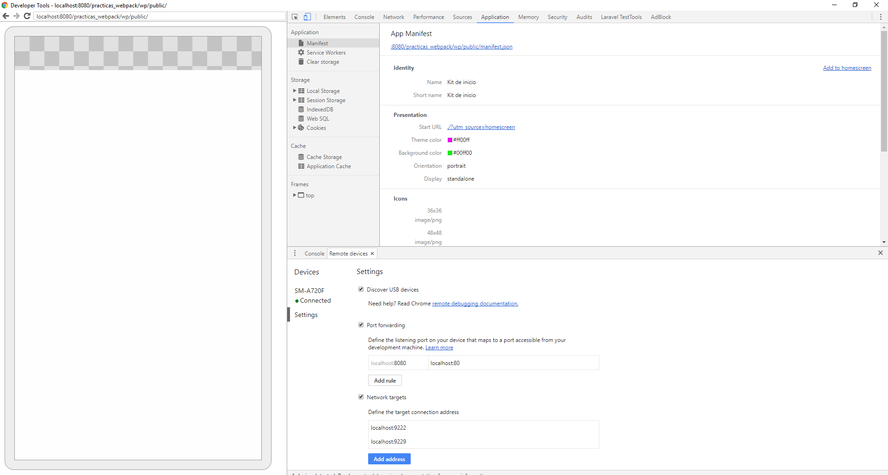
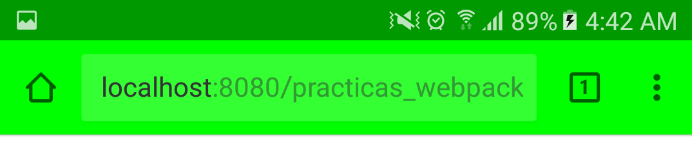

# Configuración para realizar pruebas del desarrollo de PWA en chrome

* [Depuración remota](https://developers.google.com/web/tools/chrome-devtools/remote-debugging/) - Guía para activar la depuración remota en chrome.

  **Nota: Si la depuración remota no se activa con el tutorial anterior se recomienda:**

  * Instalar [SDK Platform Tools](https://developer.android.com/studio/releases/platform-tools.html)
  * Ejecutar comando `adb.exe devices`, se deberá ver en consola un resultado similar a:
    ```console
    adb.exe devices
    List of devices attached
    ABCDEFG123  device
    ```
  * Seguidamente asginar permiso al dispositivo en el que se realizará la depuración remota
  * Al ejecutar el comando se espara una respuesta similar a:

* Puede consultar información sobre [dispositivo no visible](https://stackoverflow.com/questions/29983673/cant-see-my-device-of-chrome-inspect-devices), en la cual se describe la solución al problema de un dispositivo no visible al querer usar la depuración remota

## Demo de pruebas de la configuración de depuración remota en Chrome

Configuración recomendada para chrome en el uso de la depuración remota:


Demo en chrome - vista smathphone:

Demo en smartphone - vista smathphone:

